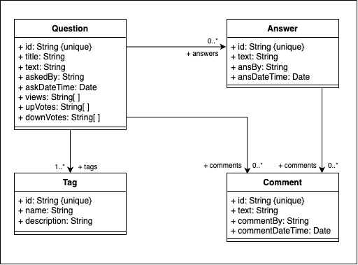

# FakeStackOverflow

FakeStackOverflow is a full-stack web application designed to emulate the functionality of the popular Stack Overflow platform. This project enables users to post questions, provide answers, and engage in discussions through a voting and commenting system.

## Features

- **User Authentication**: Secure user login and session management.
- **Question Management**: Users can create, edit, and delete questions.
- **Answer Submission**: Users can post answers to existing questions.
- **Voting System**: Upvote and downvote functionality for questions and answers.
- **Commenting System**: Add comments to questions and answers.
- **Tagging**: Categorize questions using descriptive tags.
- **Real-Time Updates**: Live question and answer updates using Socket.IO.
- **Filtering & Sorting**: Search, filter, and sort questions based on criteria like popularity, recency, and tags.

## Tech Stack

### Frontend
- **React.js**: Component-based UI development
- **TypeScript**: Strongly typed JavaScript
- **Axios**: HTTP requests
- **Socket.IO-client**: Real-time updates

### Backend
- **Node.js**: Server-side runtime
- **Express.js**: Web framework for API development
- **MongoDB**: NoSQL database
- **Mongoose**: MongoDB ORM
- **Socket.IO**: Real-time bidirectional event-based communication
- **Jest**: Testing framework for unit and integration tests

## Database Architecture

The schemas for the database are documented in the directory `server/models/schema`.
A class diagram for the schema definition is shown below:




## Installation

### Prerequisites
Ensure you have the following installed:
- [Node.js](https://nodejs.org/)
- [MongoDB](https://www.mongodb.com/try/download/community)

### Setup
Clone the repository:
```sh
 git clone https://github.com/saideep2000/fake_stackoverflow.git
 cd fake_stackoverflow
```

#### Install Dependencies
```sh
cd client && npm install
cd ../server && npm install
```

#### Configure Environment Variables
Create a `.env` file in the **client** directory:
```sh
REACT_APP_SERVER_URL=http://localhost:8000
```
Create a `.env` file in the **server** directory:
```sh
MONGODB_URI=mongodb://127.0.0.1:27017/fake_so
CLIENT_URL=http://localhost:3000
PORT=8000
```

#### Start the Application
**Start MongoDB:**
```sh
mongod --dbpath /path/to/data/db
```
**Populate the Database:**
```sh
cd server
npx ts-node populate_db.ts mongodb://127.0.0.1:27017/fake_so
```
**Run Backend Server:**
```sh
cd server
npm start
```
**Run Frontend:**
```sh
cd client
npm start
```

## Running Tests
To run the tests, ensure the MongoDB instance is running and execute:
```sh
cd server
npm test
```

## API Endpoints
The API provides the following key endpoints:

### **Questions**
- `GET /questions` - Fetch all questions
- `POST /questions` - Create a new question
- `GET /questions/:id` - Fetch a specific question by ID
- `POST /questions/upvote/:id` - Upvote a question
- `POST /questions/downvote/:id` - Downvote a question

### **Answers**
- `POST /answers` - Submit an answer
- `GET /answers/:id` - Get answers for a question
- `POST /answers/upvote/:id` - Upvote an answer
- `POST /answers/downvote/:id` - Downvote an answer

### **Tags**
- `GET /tags` - Fetch all available tags
- `GET /tags/:name` - Fetch a tag by name

### **Comments**
- `POST /comments` - Add a comment to a question or answer

## Contributing
Contributions are welcome! To contribute:
1. Fork the repository
2. Create a new branch (`git checkout -b feature-branch`)
3. Commit your changes (`git commit -m "Added new feature"`)
4. Push to the branch (`git push origin feature-branch`)
5. Open a pull request

## License
This project is licensed under the MIT License.

## Acknowledgments
This project is inspired by Stack Overflow and built as a learning exercise in full-stack web development.

